<p align="center">
  
</p>

<h1 align="center">Гиперион</h1>

<p align="center">
  <strong>Субагентская система для нарезки Shorts / Reels · режимы монтажа · publish desk · Дзен</strong>
</p>

<p align="center">
  <em>Гиперион · 20+ субагентов · Cursor Agent · Whisper · FFmpeg · обложки · очередь публикации</em>
</p>

<p align="center">
  <a href="#-быстрая-установка">
    
  </a>
  &nbsp;
  <a href="https://t.me/maya_pro">
    
  </a>
  &nbsp;
  <a href="docs/ARCHITECTURE.md">
    
  </a>
</p>

<p align="center">
  
  
  
  
  
</p>

---

## Что это

**Гиперион** (`hyperion`) — плагин для Cursor, который превращает длинное видео (вебинар, эфир, урок, подкаст, talking head) в набор вертикальных клипов для YouTube Shorts / Instagram Reels / TikTok / Telegram / VK / **Дзен**.

Система не режет «по таймеру». Субагенты понимают речь, выбирают законченные мысли в диапазоне `min–max` из UI (например 30–90 с), отбраковывают слабое, уточняют границы и только потом режут, субтитруют и упаковывают.

### Что нового в 0.4.4

| Возможность | Суть |
|-------------|------|
| **4 режима монтажа** | Обычный · Вебинар · Подкаст · Продажи |
| **Slim Agent P0** | Решения пишет агент (`decision_source=agent`), не эвристика |
| **Длина клипов из brief** | `clip_count` / `min_sec` / `max_sec` — реальный контракт (spread short/mid/long) |
| **Publish desk** | Results UI → галочки → обложки → очередь `READY_TO_PUBLISH` |
| **Дзен** | Встроенный Playwright-клиент: title, description, до 5 тегов-чипов, обложка |
| **UI Гиперион** | Локальный bridge `http://127.0.0.1:8765/` — загрузка, параметры, результаты |

> **20+ субагентов** работают как монтажная студия: intake, transcriber, editor, boundary-refiner, cutter, guardian, metadata, packager, cover-writer, publish-prep и другие.

---

## Кнопки

<p align="center">
  <a href="#-быстрая-установка"></a>
  &nbsp;
  <a href="https://t.me/maya_pro"></a>
  &nbsp;
  <a href="docs/INSTALL.md"></a>
  &nbsp;
  <a href="docs/ARCHITECTURE.md"></a>
</p>

---

## Схема работы

```mermaid
flowchart LR
  A[📹 Длинное видео] --> B[🧠 Whisper + смысл]
  B --> C[✂️ Редакция субагентов]
  C --> D[🎬 Монтаж 9:16 · 4 режима]
  D --> E[🔤 Субтитры]
  E --> F[✅ Guardian QA]
  F --> G[📝 SEO titles]
  G --> H[📦 Publish bundle]
  H --> I[☑️ Выбор клипов]
  I --> J[🖼 Обложки + очередь]
  J --> K[🚀 Дзен / ручная загрузка]
```



Подробная схема: [`docs/ARCHITECTURE.md`](docs/ARCHITECTURE.md)  
Роли агентов: [`docs/AGENTS.md`](docs/AGENTS.md)  
Публикация (SEO → галочки → обложки → очередь): [`docs/PUBLISH.md`](docs/PUBLISH.md)

### Пайплайн одной строкой

```text
Intake → Whisper → Cleanup∥Candidates → Moments → Editor
→ Boundary(+montage) → Cutter(+loudnorm, layout) → Subtitles∥Metadata
→ Burn → Guardian → Packager → Results UI → Covers → Publish queue → Дзен
```

Slim P0: scorekeeper / virality / dramaturg / audio-polisher / post-render — внутри editor / boundary / cutter / guardian (отдельные Task только для ремонта).
---

## ⚡ Быстрая установка

### Windows (рекомендуется)

```powershell
git clone https://github.com/Horosheff/hyperion-reels.git
cd hyperion-reels
.\bootstrap-videoshorts.ps1
.\install-plugin.ps1
```

Затем **перезапустите Cursor**.

Полная инструкция без ошибок (для людей и для нейросетей):  
👉 **[`docs/INSTALL.md`](docs/INSTALL.md)**

### Что делает bootstrap

| Шаг | Действие |
|-----|----------|
| 1 | Проверяет Python 3.10+ |
| 2 | Ставит pip-зависимости (`faster-whisper`, OpenCV, MediaPipe…) |
| 3 | Пытается установить FFmpeg (`winget install Gyan.FFmpeg`) |
| 4 | Пишет отчёт `videoshorts-memory/dependencies-report.json` |

### Правила для нейросетей / агентов Cursor

Если установку делает агент — он обязан идти строго по [`docs/INSTALL.md`](docs/INSTALL.md):

1. Проверить `python` / `ffmpeg` / `ffprobe`
2. Запустить `.\bootstrap-videoshorts.ps1`
3. Убедиться, что `dependencies-report.json` → `ready: true`
4. Запустить `.\install-plugin.ps1`
5. Попросить пользователя **перезапустить Cursor**
6. Только потом открывать UI и `/videoshorts-new`

**Нельзя** стартовать Whisper/нарезку, пока зависимости не `ready`.  
**Нельзя** путать Agent-режим с `run_pipeline.py` (это только диагностика).

Промпт, который можно дать агенту:

```text
Установи Гиперион из https://github.com/Horosheff/hyperion-reels
Строго по docs/INSTALL.md:
bootstrap → ready=true → install-plugin → перезапуск Cursor → UI.
Нарезку не запускай, пока зависимости не готовы.
```

### Запуск UI

```powershell
.\open-videoshorts-ui.ps1
```

Откроется `http://127.0.0.1:8765/`

1. Нажмите **«Добавить файл локально»**
2. Проверьте настройки (или кнопку **«Проверить и применить настройки»**)
3. При необходимости — **«Установить недостающее»**
4. Нажмите **«OK — передать Cursor Director»**
5. В Cursor запустите `/videoshorts-new` или попросите Директора продолжить пайплайн
6. Результаты: `http://127.0.0.1:8765/results` или `/videoshorts-results`

---

## Что на выходе

| Артефакт | Описание |
|----------|----------|
| `clip_XX.mp4` | Вертикальные ролики 9:16 с субтитрами |
| ASS / SRT | Sidecar-субтитры |
| Metadata | Title, description, hashtags |
| Publish folder | Готовый пакет для ручной загрузки |
| QA reports | Guardian, audio, safe-zone, post-render |

---

## Возможности

- **Смысловая нарезка** 30–60 сек, не фиксированные окна
- **Dual-screen webinar** 30/70 с детекцией лица
- **Karaoke-субтитры** (шаблоны mrbeast / hormozi / minimal / neon / fire)
- **Редакционный loop**: editor + virality + dramaturg + boundary refiner
- **Guardian v2**: длина, вертикаль, audio, decision evidence
- **Автопроверка зависимостей** для новых пользователей
- **HTML UI** без base64-гигантов: файл идёт через localhost bridge

---

## Требования

- [Cursor](https://cursor.com)
- Python **3.10+**
- **FFmpeg** + **ffprobe** в PATH
- Windows 10/11 (основной сценарий), macOS/Linux — через те же скрипты

Опционально: NVIDIA GPU для ускорения Whisper.

---

## Команды Cursor

| Команда | Действие |
|---------|----------|
| `/videoshorts-new` | Новая нарезка |
| `/videoshorts-results` | Открыть результаты |

---

## Структура репозитория

```text
hyperion-reels/
├── assets/                 # баннер и визуалы
├── agents/                 # субагенты Task
├── skills/                 # инструкции агентов
├── rules/                  # оркестрация Director
├── scripts/                # Whisper / FFmpeg / QA
├── ui/                     # HTML upload + results
├── docs/                   # схемы и роли
├── bootstrap-videoshorts.ps1
├── install-plugin.ps1
└── open-videoshorts-ui.ps1
```

---

## Telegram

Новости, разборы и обновления системы монтажа:

<p align="center">
  <a href="https://t.me/maya_pro">
    
  </a>
</p>

👉 **https://t.me/maya_pro**

---

## Лицензия

MIT — см. [`LICENSE`](LICENSE)

---

<p align="center">
  <strong>Гиперион</strong> · субагентская система монтажа · сделано для создателей контента
</p>

<p align="center">
  <a href="https://t.me/maya_pro">Telegram</a> ·
  <a href="docs/INSTALL.md">Установка для агентов</a> ·
  <a href="docs/ARCHITECTURE.md">Архитектура</a> ·
  <a href="docs/AGENTS.md">Субагенты</a>
</p>
