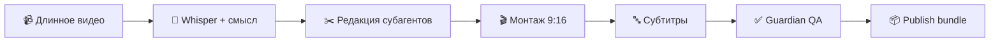

<p align="center">
  
</p>

<h1 align="center">Гиперион</h1>

<p align="center">
  <strong>Субагентская система для нарезки и монтажа Shorts / Reels из длинных видео</strong>
</p>

<p align="center">
  <em>БОЖЕНЬКА МОНТАЖА · 20+ субагентов · Cursor + Whisper + FFmpeg</em>
</p>

<p align="center">
  <a href="#-быстрая-установка">
    
  </a>
  &nbsp;
  <a href="https://t.me/maya_pro">
    
  </a>
  &nbsp;
  <a href="docs/ARCHITECTURE.md">
    
  </a>
</p>

<p align="center">
  
  
  
  
  
</p>

---

## Что это

**Гиперион** — плагин для Cursor, который превращает длинное видео (вебинар, эфир, урок, подкаст) в набор вертикальных клипов для YouTube Shorts / Instagram Reels / TikTok.

Система не режет «по таймеру». Сначала субагенты понимают речь, выбирают законченные мысли, отбраковывают слабые моменты, уточняют границы, пишут монтажное ТЗ — и только потом режут, субтитруют и упаковывают.

> **20+ субагентов** работают как монтажная студия: profiler, intake, transcriber, editor, virality critic, dramaturg, cutter, guardian, packager и другие.

---

## Кнопки

<p align="center">
  <a href="#-быстрая-установка"></a>
  &nbsp;
  <a href="https://t.me/maya_pro"></a>
  &nbsp;
  <a href="docs/AGENTS.md"></a>
  &nbsp;
  <a href="docs/ARCHITECTURE.md"></a>
</p>

---

## Схема работы



Подробная схема: [`docs/ARCHITECTURE.md`](docs/ARCHITECTURE.md)  
Роли агентов: [`docs/AGENTS.md`](docs/AGENTS.md)

### Пайплайн одной строкой

```text
Profiler → Intake → Whisper → Cleanup → Candidates → Moments
→ Scores → Editor → Virality → Boundaries → Dramaturg → Montage
→ Cutter → Audio → Subtitles → Burn → Guardian → Post-render
→ Metadata → Packager → (Fixic при сбоях)
```

---

## ⚡ Быстрая установка

### Windows (рекомендуется)

```powershell
git clone https://github.com/Horosheff/hyperion-reels.git
cd hyperion-reels
.\bootstrap-videoshorts.ps1
.\install-plugin.ps1
```

Затем **перезапустите Cursor**.

### Что делает bootstrap

| Шаг | Действие |
|-----|----------|
| 1 | Проверяет Python 3.10+ |
| 2 | Ставит pip-зависимости (`faster-whisper`, OpenCV, MediaPipe…) |
| 3 | Пытается установить FFmpeg (`winget install Gyan.FFmpeg`) |
| 4 | Пишет отчёт `videoshorts-memory/dependencies-report.json` |

### Запуск UI

```powershell
.\open-videoshorts-ui.ps1
```

Откроется `http://127.0.0.1:8765/`

1. Нажмите **«Добавить файл локально»**
2. Проверьте настройки (или кнопку **«Проверить и применить настройки»**)
3. При необходимости — **«Установить недостающее»**
4. Нажмите **«OK — передать Cursor Director»**
5. В Cursor запустите `/videoshorts-new` или попросите Директора продолжить пайплайн
6. Результаты: `http://127.0.0.1:8765/results` или `/videoshorts-results`

---

## Что на выходе

| Артефакт | Описание |
|----------|----------|
| `clip_XX.mp4` | Вертикальные ролики 9:16 с субтитрами |
| ASS / SRT | Sidecar-субтитры |
| Metadata | Title, description, hashtags |
| Publish folder | Готовый пакет для ручной загрузки |
| QA reports | Guardian, audio, safe-zone, post-render |

---

## Возможности

- **Смысловая нарезка** 30–60 сек, не фиксированные окна
- **Dual-screen webinar** 30/70 с детекцией лица
- **Karaoke-субтитры** (шаблоны mrbeast / hormozi / minimal / neon / fire)
- **Редакционный loop**: editor + virality + dramaturg + boundary refiner
- **Guardian v2**: длина, вертикаль, audio, decision evidence
- **Автопроверка зависимостей** для новых пользователей
- **HTML UI** без base64-гигантов: файл идёт через localhost bridge

---

## Требования

- [Cursor](https://cursor.com)
- Python **3.10+**
- **FFmpeg** + **ffprobe** в PATH
- Windows 10/11 (основной сценарий), macOS/Linux — через те же скрипты

Опционально: NVIDIA GPU для ускорения Whisper.

---

## Команды Cursor

| Команда | Действие |
|---------|----------|
| `/videoshorts-new` | Новая нарезка |
| `/videoshorts-results` | Открыть результаты |

---

## Структура репозитория

```text
hyperion-reels/
├── assets/                 # баннер и визуалы
├── agents/                 # субагенты Task
├── skills/                 # инструкции агентов
├── rules/                  # оркестрация Director
├── scripts/                # Whisper / FFmpeg / QA
├── ui/                     # HTML upload + results
├── docs/                   # схемы и роли
├── bootstrap-videoshorts.ps1
├── install-plugin.ps1
└── open-videoshorts-ui.ps1
```

---

## Telegram

Новости, разборы и обновления системы монтажа:

<p align="center">
  <a href="https://t.me/maya_pro">
    
  </a>
</p>

👉 **https://t.me/maya_pro**

---

## Лицензия

MIT — см. [`LICENSE`](LICENSE)

---

<p align="center">
  <strong>Гиперион</strong> · боженька монтажа · сделано для создателей контента
</p>

<p align="center">
  <a href="https://t.me/maya_pro">Telegram</a> ·
  <a href="docs/ARCHITECTURE.md">Архитектура</a> ·
  <a href="docs/AGENTS.md">Субагенты</a>
</p>
