# Субагенты Гиперион

20+ специализированных агентов. Каждый делает одну работу и передаёт результат дальше.

## Команда монтажа

| # | Агент | Роль простыми словами |
|---|-------|------------------------|
| 1 | `videoshorts-system-profiler` | Проверяет компьютер и зависимости |
| 2 | `videoshorts-intake` | Принимает видео и brief |
| 3 | `videoshorts-transcriber` | Делает расшифровку речи (Whisper) |
| 4 | `videoshorts-cleanup-planner` | Планирует удаление пауз и «эээ/ну» |
| 5 | `videoshorts-candidate-generator` | Находит 30–80 потенциальных моментов |
| 6 | `videoshorts-moment-finder` | Выбирает хайлайты в диапазоне brief (min–max сек, переменная длина) |
| 7 | `videoshorts-scorekeeper` | Ставит оценки hook/virality/quality |
| 8 | `videoshorts-editor` | Отбраковывает скучное и обрубленное |
| 9 | `videoshorts-virality-critic` | Смотрит, будет ли клип шариться |
| 10 | `videoshorts-boundary-refiner` | Точно ставит начало и конец мысли |
| 11 | `videoshorts-dramaturg` | Проверяет драматургию клипа |
| 12 | `videoshorts-montage-planner` | Пишет монтажное ТЗ |
| 13 | `videoshorts-cutter` | Режет вертикальное видео 9:16 |
| 14 | `videoshorts-audio-polisher` | Проверяет и нормализует звук |
| 15 | `videoshorts-subtitle-writer` | Пишет субтитры ASS/SRT |
| 16 | `videoshorts-subtitle-burner` | Вшивает субтитры в MP4 |
| 17 | `videoshorts-guardian` | Финальный QA (Guardian v2) |
| 18 | `videoshorts-post-render-reviewer` | Смотрит готовые ролики после рендера |
| 19 | `videoshorts-metadata-writer` | SEO titles/descriptions для YouTube, Instagram, TikTok, Telegram |
| 20 | `videoshorts-packager` | Собирает пакет для ручной загрузки |
| 21 | `videoshorts-cover-writer` | Обложки для выбранных к публикации клипов |
| 22 | `videoshorts-publish-prep` | Очередь `READY_TO_PUBLISH` (adapters платформ — позже) |
| 23 | `videoshorts-fixic` | Чинит пайплайн, если были сбои |

## Служебные

| Агент | Роль |
|-------|------|
| `videoshorts-director` | Описание оркестрации (в чате директором выступает основной агент) |
| `FOR-AGENTS` | Общий контекст для агентов |

## Как они связаны

```mermaid
flowchart LR
  subgraph prep [Подготовка]
    P[Profiler]
    I[Intake]
  end
  subgraph sense [Смысл]
    T[Transcriber]
    C[Cleanup]
    Cand[Candidates]
    M[Moments]
  end
  subgraph review [Редакция]
    S[Score]
    E[Editor]
    V[Virality]
    B[Boundaries]
    D[Dramaturg]
  end
  subgraph render [Рендер]
    Cut[Cutter]
    A[Audio]
    Sub[Subtitles]
    Burn[Burn]
  end
  subgraph qa [QA и выпуск]
    G[Guardian]
    PR[Post-render]
    Meta[Metadata SEO]
    Pack[Packager]
  end
  subgraph publish [Publish desk]
    Sel[Галочки]
    Cov[Обложки]
    Q[Очередь]
  end
  prep --> sense --> review --> render --> qa --> publish
```

Публикация: после packager откройте Results UI, выберите клипы и подготовьте обложки/очередь — [`docs/PUBLISH.md`](PUBLISH.md).

## Правило для пользователей

Не нужно вызывать всех агентов вручную.

1. Откройте UI
2. Загрузите видео
3. Нажмите **OK — передать Cursor Director**
4. Директор сам запустит нужную цепочку
5. В Results UI поставьте галочки и нажмите **Подготовить обложки и очередь**
