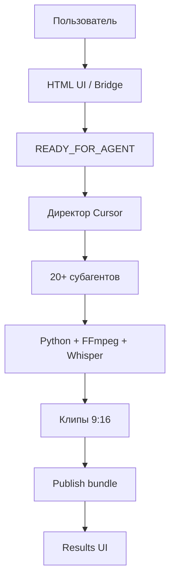
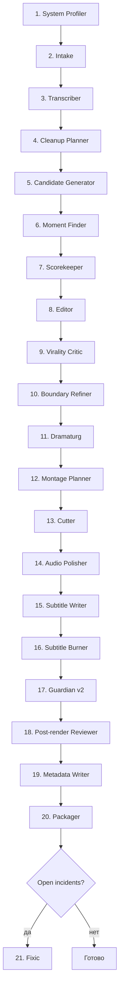

# Архитектура Гиперион

Понятная схема работы субагентской системы монтажа Shorts/Reels.

## Большая картина



## Что делает каждый слой

| Слой | Задача | Кто отвечает |
|------|--------|--------------|
| UI | Загрузка видео, настройки, просмотр результата | `open-videoshorts-ui.ps1`, `ui/` |
| Директор | Оркестрация Task-цепочки | основной агент Cursor |
| Субагенты | Решения: что резать, как монтировать, что отбраковать | `agents/`, `skills/` |
| Скрипты | Инструменты: Whisper, ffmpeg, ASS, QA | `scripts/` |
| Память | Brief, transcript, moments, clips, reports | `videoshorts-memory/` |

## Полный пайплайн



## Этапы простыми словами

### 1. Подготовка
- Проверяет ПК, Python, FFmpeg, Whisper
- При необходимости ставит зависимости
- Принимает видео и brief

### 2. Понимание речи
- Whisper транскрибирует видео
- Планируется чистка пауз и филлеров
- Ничего ещё не режется

### 3. Редактура смысла
- 30–80 кандидатов моментов
- Выбор лучших хайлайтов 30–60 сек
- Оценки hook / virality / quality
- Редактор и вирусолог отбраковывают слабое
- Уточняются границы законченной мысли
- Драматург проверяет дугу: setup → tension → insight → ending

### 4. Монтаж
- Монтажное ТЗ: jump cuts, silence remove, zoom
- Dual-screen 9:16 (webinar 30/70)
- Полировка звука
- Субтитры ASS/SRT и burn в MP4

### 5. Контроль качества
- Guardian v2: длина, вертикаль, audio, safe-zone
- Post-render review готовых MP4
- Metadata: title, description, hashtags
- Publish-пакет для ручной загрузки

## Режимы запуска

| Режим | Когда использовать |
|-------|--------------------|
| **Agent** (по умолчанию) | Основной продакшен: решения принимают субагенты Cursor |
| **Local diagnostic** | Быстрый тест backend без субагентов; не считать это агентным монтажом |

## Артефакты, которые должны появиться

```text
videoshorts-memory/
  00-brief.md
  system-profile.json
  dependencies-report.json
  input/<video>
  transcripts/<stem>/transcript.json
  moments/candidate-moments.json
  moments/<stem>-moments.json
  moments/refined-moments.json
  moments/clip-decisions.json
  output/clips/<stem>/clip_XX.mp4
  output/clips/<stem>-publish/
  output/latest-results.json
```

## Принцип качества

Гиперион режет не «по таймеру», а по смыслу:

1. Есть законченная мысль
2. Есть hook в начале
3. Есть payoff в конце
4. Клип проходит Guardian и post-render review
5. Только потом publish bundle
