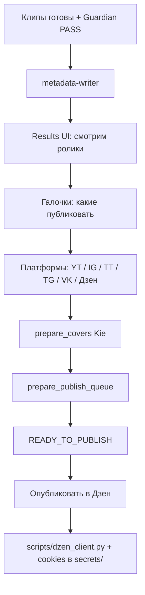

# Публикация Гиперион

Красивый контур после нарезки: SEO-тексты → выбор клипов → обложки → очередь → Дзен (Playwright).

YouTube / Instagram / TikTok / Telegram / VK API — позже. **Дзен уже встроен в плагин** (`scripts/dzen_client.py`).

## Схема



## 1. SEO titles и descriptions

Агент: `videoshorts-metadata-writer` — **пишет JSON сам** (`decision_source: agent`).

| Платформа | Поля |
|-----------|------|
| YouTube | title, description + SEO keywords + hashtags, pinned_comment |
| Instagram | title, caption, hashtags, first_comment |
| TikTok | title, description, hashtags |
| Telegram | title, caption |
| VK / Дзен | title, description, до 5 тегов (чипы) |

## 2. Выбор клипов в UI

Откройте `http://127.0.0.1:8765/results`

1. Смотрите клип
2. SEO-вкладки (в т.ч. VK / Дзен)
3. Галочка **«Публиковать этот клип»**
4. Платформы (включая **VK** и **Дзен**)
5. **«Подготовить обложки»** — Kie только для выбранных

## 3. Обложки (Kie GPT Image 2, 9:16)

Скрипт: `scripts/prepare_covers.py`

Brand kit: `videoshorts-memory/brand/covers/brand-urls.json` (HTTPS avatar + refs).

Ключ: `videoshorts.local.env` → `KIE_API_KEY` (шаблон: `videoshorts.local.env.example`).

## 4. Очередь публикации

`scripts/prepare_publish_queue.py` → `publish-queue.json`

- `zen` → `adapter: playwright:dzen`
- `vk` → `adapter: future:vk`
- остальные → `future:*`

## 5. Дзен (внутри плагина)

Всё bundled — **не нужен** внешний каталог Tilda:

| Файл | Назначение |
|------|------------|
| `scripts/dzen_client.py` | Playwright: upload, description, ≤5 тегов-чипов, Publish, закрытие браузера |
| `scripts/publish_dzen.py` | Обёртка для Results UI / CLI |
| `scripts/dzen_login_save.py` | Ручной вход → cookies |
| `videoshorts-memory/secrets/dzen_storage_state.json` | Cookies (gitignored) |
| `videoshorts.local.env` | `DZEN_CHANNEL_NAME`, опционально login (gitignored) |

Шаблон env: `videoshorts.local.env.example`.

Зависимости: `playwright`, `python-dotenv` в `scripts/requirements.txt`  
(после install: `playwright install chromium`).

### UI

1. **Войти в Дзен (cookies)** — Playwright headed; cookies → `videoshorts-memory/secrets/`.
2. На карточке с обложкой: **Опубликовать в Дзен** / **Черновик Дзен**.
3. После Publish: ждать ~10 с → браузер закрывается → зелёная галочка в Results.

### CLI

```powershell
cd scripts
python publish_dzen.py --status
python publish_dzen.py --login-only
python publish_dzen.py ..\videoshorts-memory\output\clips\<stem> --index 7 --draft
python publish_dzen.py ..\videoshorts-memory\output\clips\<stem> --index 7
```

Ограничения Дзен: вертикаль 9:16, до ~2 мин, MP4/WEBM, **максимум 5 тегов**.

Лог: `output/clips/<stem>/dzen-publish-log.json`  
Скриншоты: `videoshorts-memory/output/dzen-screenshots/`

## 6. Будущие adapters

| Adapter | Статус |
|---------|--------|
| `playwright:dzen` | готов (bundled) |
| `future:vk` | чекбокс + payload |
| `future:youtube` / IG / TT / TG | позже |

## Агенты

| Агент | Роль |
|-------|------|
| `videoshorts-metadata-writer` | SEO titles/descriptions |
| `videoshorts-cover-writer` | AI-обложки выбранных клипов |
| `videoshorts-publish-prep` | selection → covers → queue → (Дзен кнопка) |

## Чеклист

- [ ] Клипы прошли QA
- [ ] Метаданные есть
- [ ] Выбраны клипы + платформы (Дзен)
- [ ] Обложки готовы
- [ ] Cookies Дзен (или «Войти в Дзен»)
- [ ] «Опубликовать в Дзен»
- [ ] В репозитории нет `videoshorts.local.env` и `secrets/*.json` (только `.example` / `.gitkeep`)
