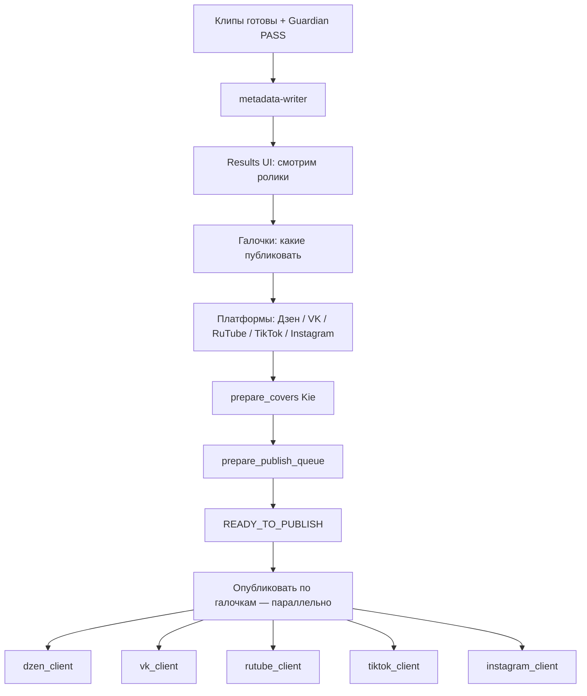

# Публикация Гиперион

Красивый контур после нарезки: SEO-тексты → выбор клипов → обложки → очередь → **параллельная** публикация в Дзен / VK / RuTube / TikTok / Instagram (Playwright).

## Схема


```mermaid
flowchart TD
  A[Клипы готовы + Guardian PASS] --> B[metadata-writer]
  B --> C[Results UI: смотрим ролики]
  C --> D[Галочки: какие публиковать]
  D --> E[Платформы: Дзен / VK / RuTube / TikTok / Instagram]
  E --> F[prepare_covers Kie]
  F --> G[prepare_publish_queue]
  G --> H[READY_TO_PUBLISH]
  H --> I["Опубликовать по галочкам — параллельно"]
  I --> J1[dzen_client]
  I --> J2[vk_client]
  I --> J3[rutube_client]
  I --> J4[tiktok_client]
  I --> J5[instagram_client]
```

## 1. SEO titles и descriptions

Агент: `videoshorts-metadata-writer` — **пишет JSON сам** (`decision_source: agent`).

| Платформа | Поля |
|-----------|------|
| YouTube | title, description + SEO keywords + hashtags, pinned_comment |
| Instagram | title, caption, hashtags, first_comment |
| TikTok | title, description, hashtags |
| Telegram | title, caption |
| VK / Дзен | title, description, до 5 тегов (чипы) |

## 2. Выбор клипов в UI

Откройте `http://127.0.0.1:8765/results`

1. Смотрите клип
2. SEO-вкладки (в т.ч. VK / Дзен)
3. Галочка **«Публиковать этот клип»**
4. Платформы (**Дзен / VK / RuTube / TikTok / Instagram**)
5. **«Подготовить обложки»** — Kie только для выбранных
6. **«Опубликовать (по галочкам)»** — все отмеченные платформы стартуют **одновременно** (`/api/publish-platforms`, `ThreadPoolExecutor`)

Playwright-окна открываются на **мониторе №1 (правый)** — см. `docs/PLAYWRIGHT-DISPLAY.md` (`PLAYWRIGHT_MONITOR=1`).

## 3. Обложки (Kie GPT Image 2, 9:16)

Скрипт: `scripts/prepare_covers.py`

Brand kit: `videoshorts-memory/brand/covers/brand-urls.json` (HTTPS avatar + refs).

Ключ: `videoshorts.local.env` → `KIE_API_KEY` (шаблон: `videoshorts.local.env.example`).

## 4. Очередь публикации

`scripts/prepare_publish_queue.py` → `publish-queue.json`

- `zen` → `adapter: playwright:dzen`
- `vk` → `adapter: playwright:vk` (`publish_vk.py`)
- `rutube` → `adapter: playwright:rutube` (`publish_rutube.py`) — обложка: таб **Shorts** обязателен
- `tiktok` → `adapter: playwright:tiktok` (`publish_tiktok.py`) — диалог «Продолжить публикацию?» → второе **Опубликовать**
- `instagram` → `adapter: playwright:instagram` (`publish_instagram.py`) — Reels, без Windows file dialog (`set_input_files`)

## 5. Дзен (внутри плагина)

Всё bundled — **не нужен** внешний каталог Tilda:

| Файл | Назначение |
|------|------------|
| `scripts/dzen_client.py` | Playwright: upload, description, ≤5 тегов-чипов, Publish, закрытие браузера |
| `scripts/publish_dzen.py` | Обёртка для Results UI / CLI |
| `scripts/dzen_login_save.py` | Ручной вход → cookies |
| `videoshorts-memory/secrets/dzen_storage_state.json` | Cookies (gitignored) |
| `videoshorts.local.env` | `DZEN_CHANNEL_NAME`, опционально login (gitignored) |

Шаблон env: `videoshorts.local.env.example`.

Зависимости: `playwright`, `python-dotenv` в `scripts/requirements.txt`  
(после install: `playwright install chromium`).

### UI

1. **Войти в Дзен (cookies)** — Playwright headed; cookies → `videoshorts-memory/secrets/`.
2. На карточке: галочки платформ → **Опубликовать (по галочкам)** (параллельно со всеми отмеченными).
3. После Publish: ждать завершения всех браузеров → зелёные галочки в Results.

### CLI

```powershell
cd scripts
python publish_dzen.py --status
python publish_dzen.py --login-only
python publish_dzen.py ..\videoshorts-memory\output\clips\<stem> --index 7 --draft
python publish_dzen.py ..\videoshorts-memory\output\clips\<stem> --index 7
python publish_vk.py ..\videoshorts-memory\output\clips\<stem> --index 1
python publish_rutube.py ..\videoshorts-memory\output\clips\<stem> --index 1
python publish_tiktok.py ..\videoshorts-memory\output\clips\<stem> --index 1
python publish_instagram.py ..\videoshorts-memory\output\clips\<stem> --index 1
python publish_instagram.py --login-only
python publish_instagram.py --status
```

Ограничения Дзен: вертикаль 9:16, до ~2 мин, MP4/WEBM, **максимум 5 тегов**.

Лог: `output/clips/<stem>/dzen-publish-log.json`  
Скриншоты: `videoshorts-memory/output/dzen-screenshots/`

### Instagram Reels (внутри плагина)

| Файл | Назначение |
|------|------------|
| `scripts/instagram_client.py` | Playwright: Create → video `set_input_files` → crop 9:16 → caption → Поделиться |
| `scripts/publish_instagram.py` | Обёртка для Results UI / CLI |
| `scripts/instagram_login_save.py` | Ручной вход → cookies |
| `scripts/recordings/instagram_publish_codegen.py` | Эталон codegen |
| `videoshorts-memory/secrets/instagram_storage_state.json` | Cookies (**gitignored**) |

Не кликать «Выбрать на компьютере» — только hidden `input[type=file]` (иначе Windows Open dialog).  
После Share ждать спиннер «Публикация» / «Reels опубликовано» (не закрывать браузер рано).

Лог: `output/clips/<stem>/instagram-publish-log.json`  
Скриншоты: `videoshorts-memory/output/instagram-screenshots/`

## 6. Adapters

| Adapter | Статус |
|---------|--------|
| `playwright:dzen` | готов |
| `playwright:vk` | готов |
| `playwright:rutube` | готов (Shorts cover) |
| `playwright:tiktok` | готов (confirm dialog) |
| `playwright:instagram` | готов (Reels, no native file dialog) |
| YouTube / TG API | позже |

## Агенты

| Агент | Роль |
|-------|------|
| `videoshorts-metadata-writer` | SEO titles/descriptions |
| `videoshorts-cover-writer` | AI-обложки выбранных клипов |
| `videoshorts-publish-prep` | selection → covers → queue → (кнопка UI) |

## Чеклист

- [ ] Клипы прошли QA
- [ ] Метаданные есть
- [ ] Выбраны клипы + платформы (Дзен / VK / RuTube / TikTok / Instagram)
- [ ] Обложки готовы
- [ ] Cookies платформ (или «Войти…»)
- [ ] «Опубликовать (по галочкам)» — параллельный старт
- [ ] В репозитории нет `videoshorts.local.env` и `secrets/*.json` (только `.example` / `.gitkeep`)
